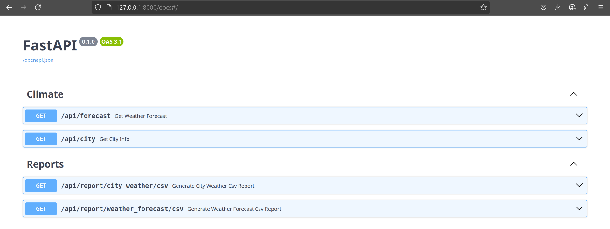
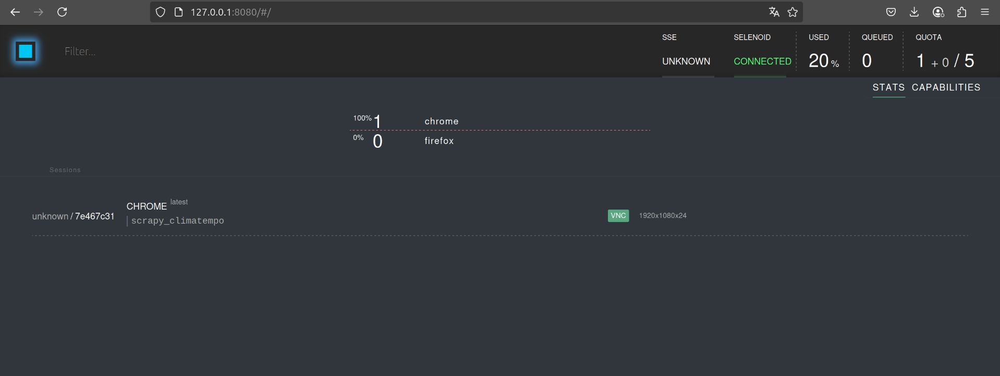
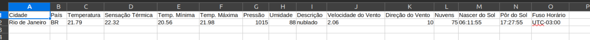
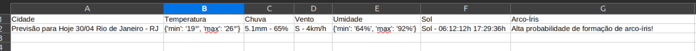

# NimbusFeed

O NimbusFeed é um sistema de coleta e disponibilização de dados meteorológicos que combina web scraping e integração com
APIs de previsão do tempo.

## 📋 Pré-requisitos

- Python 3.13
- Docker
- virtualenv

## 🚀 Instalação

### Usando Python e virtualenv

1. Clone o repositório:
    ```bash
    git clone https://github.com/matheus-feu/NimbusFeed.git
   ``` 

2. Crie um ambiente virtual:
    ```bash
    cd NimbusFeed
    python -m venv venv
    source venv/bin/activate  # Linux/Mac
    venv\Scripts\activate  # Windows
    ```

3. Instale as dependências:
    ```bash
   pip install -r requirements.txt
   ```

### Usando Docker

1. Construa e inicie os containers:
    ```bash
    docker-compose up -d
    ```

## ⚙️ Configuração

### Variáveis de Ambiente

O projeto requer as seguintes variáveis de ambiente no arquivo `.env`:

### 📝 Notas importantes sobre as variáveis:

1. **USE_HEADLESS**
    - Recomendado manter `True` em produção para economia de recursos
    - Use `False` apenas durante desenvolvimento para debug visual

2. **USE_SELENOID**
    - Necessário `True` quando usando a infraestrutura do Selenoid
    - Configure `False` para desenvolvimento local com WebDriver

3. **API_KEY**
    - Obrigatória para consultas ao OpenWeatherMap
    - Registre-se gratuitamente em https://openweathermap.org/
    - Mantenha esta chave em segurança

4. **NAME_APP**
    - Identificador único da aplicação no Selenoid
    - Usado para rastreamento e logs
    - Evite caracteres especiais e espaços

5. **HOST e PORT**
    - Em ambiente local: geralmente `localhost:4444`
    - Com Docker: use o nome do serviço definido no docker-compose
    - Verifique se a porta não está em uso por outros serviços

## 🏃 Executando o Projeto

### Método Local

1. Ative o ambiente virtual (se ainda não estiver ativo)
2. Execute o servidor:
    ```bash
    python run.py
    ```
   Nesse momento o Selenoid ja está rodando após a do `docker-compose up -d`


3. Acesse a aplicação em `http://localhost:8000/docs`
   

4. No grid do Selenoid, é possível acompanhar a execução do scraping em tempo real. Ao requisitar o endpoint
   `/api/forecast`, o processo de scraping é iniciado, abrindo uma aba do Chrome onde você pode visualizar a execução
   passo a passo.

   Acesse: http://127.0.0.1:8080/

   

5. Também é possível não usar o Selenoid, apenas o WebDriver local. Para isso, basta alterar a variável de ambiente
   `USE_SELENOID` para `False`
   e executar o projeto normalmente.


6. Para gerar relatórios, acesse o endpoint `/api/report/weather_forecast/csv` e faça o download do arquivo CSV gerado.
   Nos atuais endpoints são realizados o scraping e a chamada na API, salvo os dados no banco de dados e gerado o
   relatório.

- Relatório de previsão do tempo apartir da API OpenWeatherMap:
  
- Relatório de previsão do tempo apartir do scraping no site ClimaTempo:
  

## 🔌 Endpoints da API

### 🌡️ Previsão do Tempo Atual

#### GET `/api/forecast/{id_city}`

Rota para obter a previsão do tempo de uma cidade específica. Essa rota realiza o scraping no site ClimaTempo e retorna
os dados climáticos em JSON.
**Parâmetros:**

- `city_id` (string, obrigatório): ID da cidade a ser consultada.

Está com apenas 3 cidades cadastradas. Sendo elas: IDs permitidos: 558 (São Paulo), 321 (Rio de Janeiro), 61 (Brasília).

Utilizar algum desses IDs para realizar o teste. Está limitado as 3 cidades, pois essa numeração é um ID interno do ClimaTempo.
Não sendo possível realizar a consulta por nome da cidade. Ou ter uma tabela no banco de dados com mais opções de cidades.

**Exemplo de Requisição:**

```bash
url -X 'GET' \
  'http://127.0.0.1:8000/api/forecast?city_id=321' \
  -H 'accept: application/json'
```

**Resposta de Sucesso (200):**

```json
{
  "city": "Previsão para Hoje 30/04 Rio de Janeiro - RJ",
  "temperature": {
    "min": "19°",
    "max": "26°"
  },
  "rain": "5.1mm - 65%",
  "wind": "S - 4km/h",
  "humidity": {
    "min": "64%",
    "max": "92%"
  },
  "sun": "Sol - 06:12:12h 17:29:36h",
  "rainbow": "Alta probabilidade de formação de arco-íris!"
}
```

### 🗓️ Obter informações climáticas da cidade

#### GET `/api/city/{city_name}`

Rota para obter informações climáticas de uma cidade específica. Essa rota consulta a API OpenWeatherMap e retorna os
dados climáticos em JSON.

**Parâmetros:**

- `city_name` (string, obrigatório): Nome da cidade a ser consultada.

**Exemplo de Requisição:**

```bash
curl -X 'GET' \
  'http://127.0.0.1:8000/api/city?city_name=rio%20de%20janeiro' \
  -H 'accept: application/json'
```

**Resposta de Sucesso (200):**

```json
{
  "city": "Rio de Janeiro",
  "country": "BR",
  "temperature": 21.79,
  "feels_like": 22.32,
  "temp_min": 20.56,
  "temp_max": 21.98,
  "pressure": 1015,
  "humidity": 88,
  "description": "nublado",
  "wind_speed": 2.06,
  "wind_deg": 340,
  "clouds": 75,
  "sunrise": "06:11:55",
  "sunset": "17:27:55",
  "timezone": "UTC-03:00"
}
```

### 📊 Relatório de Previsão do Tempo

#### GET `/api/report/city_weather/csv`

Rota para gerar um relatório em CSV com as previsões do tempo coletadas. O relatório é gerado a partir dos dados
armazenados no banco de dados e pode ser baixado diretamente.

**Exemplo de Requisição:**

```bash
curl -X 'GET' \
  'http://127.0.0.1:8000/api/report/city_weather/csv' \
  -H 'accept: application/json'
```

Response Body: Download do arquivo CSV gerado.

### 📊 Relatório de Previsão do Tempo (Scraping)

#### GET `/api/report/weather_forecast/csv`

Rota para gerar um relatório em CSV com as previsões do tempo coletadas via scraping. O relatório é gerado a partir dos
dados armazenados no banco de dados e pode ser baixado diretamente.

**Exemplo de Requisição:**

```bash
curl -X 'GET' \
  'http://127.0.0.1:8000/api/report/weather_forecast/csv' \
  -H 'accept: application/json'
```

Response Body: Download do arquivo CSV gerado.

## 📁 Estrutura do Projeto

- Endpoints da API REST `/api`
- `/config` - Arquivos de configuração
- `/libs` - Bibliotecas auxiliares
- `/reports` - Relatórios gerados
- `/scraping` - Scripts de web scraping
- Ponto de entrada da aplicação `run.py`

### 📊 Fontes de Dados

1. **APIs Externas**
    - OpenWeatherMap API
    - Outros provedores meteorológicos

2. **Web Scraping**
    - Climatempo
    - Outros portais meteorológicos

## 📦 Tecnologias Utilizadas

- Python
- SQLAlchemy
- Selenium
- Selenoid
- FastAPI
- Requests
- Docker

### 🔧 Padrões de Design

- **Repository Pattern**: Para abstração do acesso a dados
- **Factory Pattern**: Na criação de scrapers
- **Strategy Pattern**: Para diferentes estratégias de coleta
- **Dependency Injection**: Para melhor testabilidade
- **Schema Pattern**: Para validação e transformação de dados

## 📝 Notas Adicionais

- O banco de dados `SQLite()` é criado automaticamente na primeira execução `nimbusfeed.db` ou o nome que escolher.
- O modo headless do Selenium pode ser configurado através da variável `USE_HEADLESS`
- Os relatórios gerados são obtidos através dos endpoints após requistar e realizar o download.
  `
